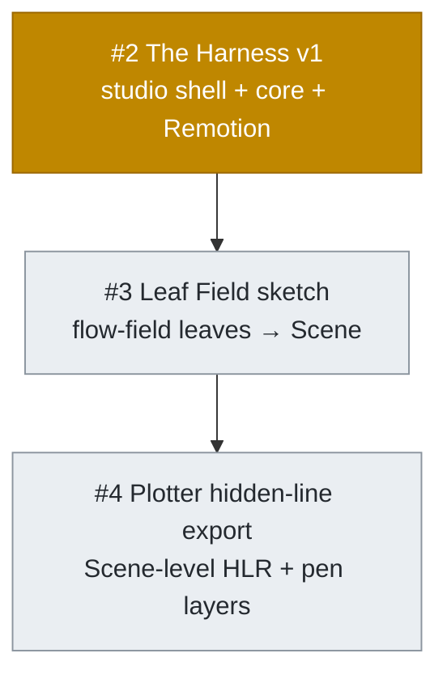

# DAG

Add a Mermaid dependency graph of an issue's **direct** sub-issues to that issue's body, so a reader sees what the issue is made of and the order it gets built in — at a glance, with status colors.

The graph is about the children, not the parent: the parent issue is **not** a node. Nodes are the direct sub-issues; edges are build-order / dependency relationships between them. No containment edges from the parent — those just add noise.

This skill edits one thing: the parent issue's body. It does not touch child issues, labels, branches, or the working tree.

For label vocabulary see [docs/agents/triage-labels.md](../../../docs/agents/triage-labels.md); for the end-of-run output and voice rules see [docs/agents/output-format.md](../../../docs/agents/output-format.md).

## Input

The user passes an issue reference: `#<N>`, a bare number, or a full `https://github.com/<owner>/<repo>/issues/<N>` URL. Resolve to a number `<N>`.

## Step 1: Fetch the parent and its direct sub-issues

```bash
gh issue view <N> --json number,title,body,url
gh api "repos/{owner}/{repo}/issues/<N>/sub_issues" \
  --jq '.[] | {number, state, title, labels: [.labels[].name]}'
```

Use only the **direct** sub-issues returned by the `sub_issues` endpoint. Do not recurse into grandchildren — this is a one-level graph of `<N>`'s immediate children.

Edge cases:

- **No sub-issues** → there's nothing to graph. Tell the user, don't edit the body, stop.
- **One sub-issue** → a single node, no edges. Still valid; write it.

## Step 2: Classify each node's status

From each child's `state` + `labels`:

- **done** — `state == "closed"`.
- **in progress** — open and carries the `in-progress` label.
- **not started** — open and does not carry `in-progress` (e.g. `needs-triage`, `ready-for-agent`, or no state label).

## Step 3: Infer the dependency edges

This is the load-bearing step — an inaccurate graph is worse than none. An edge `A --> B` means "B depends on A" (A is built first). Draw edges from real signals, not guesses:

- **Explicit dependency language** in a child body: "depends on #X", "blocked by #X", "builds on #X", "after #X lands".
- **Build-order / milestone language** in the parent body or child bodies: "v1", "Milestone 2", "Phase 1", numbered candidate features, "first … then …", "lands X as Y".
- **Obvious data/artifact flow**: child B consumes an artifact child A produces (e.g. one bakes a Scene, the next exports that Scene).

Keep the graph minimal and transitively reduced: if `A → B` and `B → C`, don't also draw `A → C`. Independent children with no relationship get no edge (they render as parallel roots — that's correct and informative).

If the dependencies are ambiguous and you can't ground an edge in the issue text, **show the user your inferred edges and ask before writing**. Accuracy beats completeness.

## Step 4: Build the Mermaid block

`flowchart TD`. One node per direct sub-issue, id `I<number>`, label `#<number> <short title>`. Keep labels short — trim the title to its essence; use `<br/>` for a second descriptive line only if it earns its place. Then the inferred edges, then the status classes.

Always define all three `classDef`s (so the legend is consistent) and assign every node a class:



Group nodes into the `class` lines by status (comma-separated ids). Follow the chart with exactly this legend line and nothing more — the arrows speak for themselves, don't explain them:

```
Node color: 🟩 done · 🟨 in progress · ⬜ not started.
```

Palette is GitHub-ish (green / amber / grey). GitHub's renderer honors `classDef`; the emoji legend keeps it readable if a strict theme drops the fills.

## Step 5: Write it into the parent body (idempotent)

The section lives under a `## Sub-issue DAG` heading.

- If the body already has a `## Sub-issue DAG` section, **replace it in place** (heading through its trailing legend line) so re-running refreshes the chart rather than stacking duplicates.
- Otherwise, **append** the section to the end of the body.

Edit via a body file, not inline shell heredocs that can mangle the existing Markdown:

```bash
gh issue view <N> --json body --jq .body > /tmp/dag-body.md
# edit /tmp/dag-body.md: replace-or-append the "## Sub-issue DAG" section
gh issue edit <N> --body-file /tmp/dag-body.md
```

Preserve the rest of the body byte-for-byte.

## Step 6: End-of-run output

Follow the three-block template:

```
DAG of #<N>'s <K> sub-issues written to its body.

- <parent issue URL>

Stop.
```

(Refreshing an existing chart terminates the chain — no natural next skill. Use `Stop.`)

## What this skill does NOT do

- It does not add the parent as a node, nor draw containment edges from parent to children. Only inter-child dependency edges.
- It does not recurse past direct sub-issues.
- It does not edit child issues, labels, branches, or any file outside the parent's body.
- It does not invent dependencies. Ungrounded edges get confirmed with the user first, or left out.

## Verification

1. **Initiative with sequential children.** Run against a `size:initiative` whose features are ordered (v1 → M2 → M3). Body gains a `## Sub-issue DAG` with one node per feature, solid edges in build order, no parent node.
2. **Status colors.** A child that's `closed` renders green, one with `in-progress` renders amber, the rest grey. Legend line present.
3. **Idempotent refresh.** Re-run on the same parent → the existing `## Sub-issue DAG` section is replaced, not duplicated.
4. **Independent children.** Two children with no relationship render as separate roots (no spurious edge).
5. **No sub-issues.** Run against a leaf issue → no body edit, a plain "nothing to graph" message.
6. **Tier-agnostic.** Works the same against a `size:feature` (slices) or `size:slice` (tasks) or an unlabeled issue.
